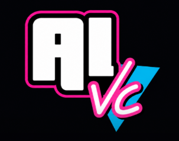

<p align="center">
  
</p>

# aiVC Engine (GTA Vice City AI Mod)

**Created by Abhay Goudannavar and Suhaan Raqeeb Kavas**

## About the Project
`aiVC-engine` is a heavily modified reverse-engineered Grand Theft Auto Vice City engine that integrates modern AI to bring NPCs to life. 

Instead of pre-recorded generic voice lines, this engine allows you to walk up to any NPC, freeze them in place (by pressing `T`), and have a real-time, dynamic conversation. The game captures your microphone audio, sends it to a Python FastAPI backend for Whisper transcription, generates an intelligent response using a Large Language Model (LLM), and synthesizes a realistic voice using ElevenLabs before playing it back inside the game world.

## Screenshots


## Development Setup & Contributing

To contribute to this engine and set it up on your own machine, you will need a legitimate copy of GTA Vice City to provide the game assets (models, textures, audio). The repository only contains the C++ source code for the engine itself.

### Requirements:
1. **WSL (Ubuntu) or Linux natively**: The engine relies on Linux tooling to build.
2. **C++ Toolchain**: GCC, Make, CMake.
3. **Libraries**: SDL2, OpenAL, libsndfile, mpg123, GLFW.
4. **GTA Vice City Assets**: The original game files.

### 1. Install Dependencies (Ubuntu/WSL)
```bash
sudo apt update
sudo apt install build-essential cmake pkg-config libsdl2-dev libopenal-dev libsndfile1-dev libmpg123-dev libglfw3-dev
```

### 2. Clone the Repository
```bash
git clone https://github.com/abhaygoudannavar/aiVC-engine.git
cd aiVC-engine
```

### 3. Build the Engine
```bash
mkdir -p build
cd build
cmake ..
cmake --build . --parallel
```
This will compile the engine and output a binary in `build/src/reVC`.

### 4. Running the Game
To run the game, your terminal's "current working directory" MUST be inside the folder containing your original GTA Vice City game assets.

```bash
cd /path/to/your/GTA_VC_1.0_Assets
/path/to/aiVC-engine/build/src/reVC
```

### Contributing
We welcome contributions! The primary areas of ongoing development include:
- `src/peds/PlayerPed.cpp` - Interaction logic and key hooks
- Connecting C++ to the Python FastAPI backend
- OpenAL audio capture

Feel free to fork the repository and submit pull requests.
